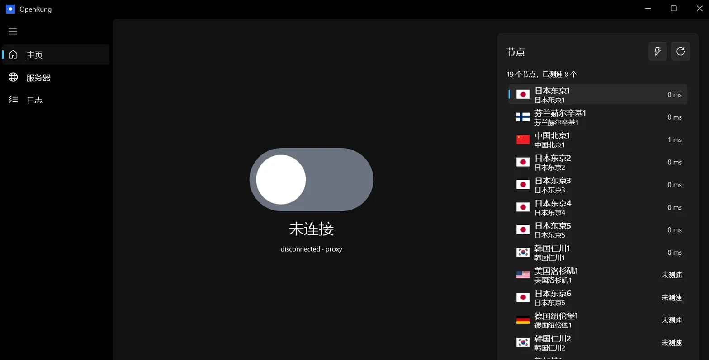
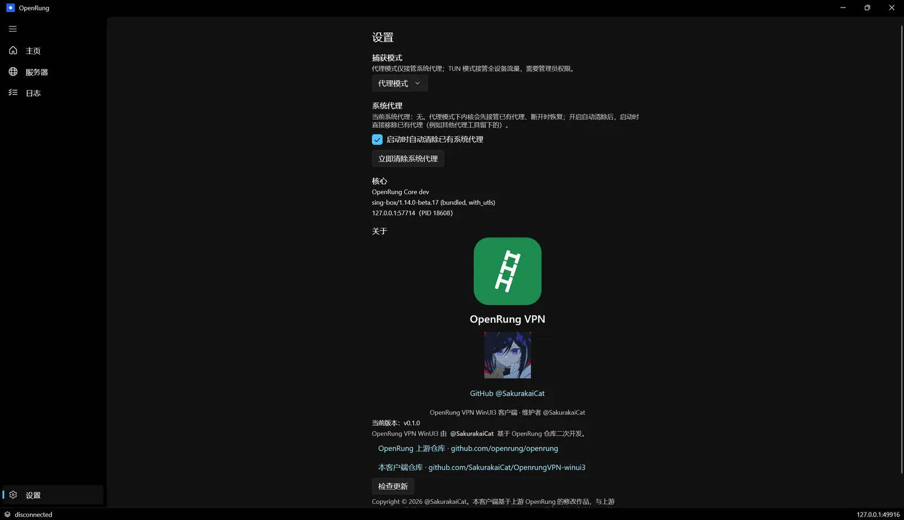
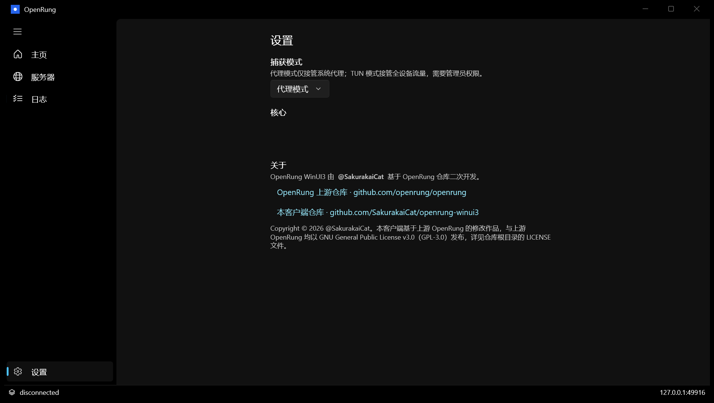
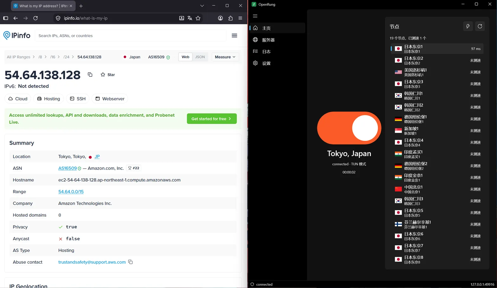

# OpenRung VPN WinUI3 客户端 / OpenRung VPN WinUI3 Client

一个使用 **WinUI 3**（Windows App SDK）构建的现代原生 Windows 客户端，
替代了在 Windows 上几乎无法使用的旧 Wails 桌面应用。
A modern, native Windows client for [OpenRung](https://github.com/openrung/openrung) built with **WinUI 3** (Windows App SDK), replacing the old Wails desktop app, which was barely usable on Windows.

一键连接到最快的节点；可在本地代理模式与全设备 TUN 模式间切换；常驻系统托盘。
One click connects you to the fastest relay; switches between local proxy mode and full-device TUN mode; lives in the system tray.

## 下载 / Download

在 [Releases](https://github.com/SakurakaiCat/OpenrungVPN-winui3/releases) 页面获取两种发行包：
Grab either package from the [Releases](https://github.com/SakurakaiCat/OpenrungVPN-winui3/releases) page:

- **安装版** `OpenRung-Setup-<版本>-x64.exe`：Inno Setup 安装向导，自动创建开始菜单/桌面快捷方式。
  **Installer** `OpenRung-Setup-<version>-x64.exe`: an Inno Setup wizard that creates Start-menu/desktop shortcuts for you.
- **便携版** `OpenRung-win-x64.zip`：解压即用，适合绿色安装或 U 盘携带。
  **Portable** `OpenRung-win-x64.zip`: unzip anywhere and run; no installation needed.

## 架构 / Architecture

```
app/    C++/WinRT WinUI 3 GUI (C++20, unpackaged, self-contained)
core/   Go sidecar openrung-core.exe — wraps connectcore + bundled sing-box,
        exposing a small authenticated loopback JSON/SSE API (see API-CONTRACT.md)
```

GUI 从不直接触碰系统代理或路由表；一切经由核心引擎完成，
因此崩溃恢复（代理快照还原）、直连优先的 WSS 回退、打洞与故障转移
与官方客户端的行为完全一致。
The GUI never touches the system proxy or the routing table itself; everything goes through the core engine, so crash recovery (proxy snapshot restore), direct-first WSS fallback, punching and failover behave exactly like the official clients.

- **代理模式**（默认）：在稳定的每安装端口上监听本地混合 HTTP/SOCKS，并将系统代理指向它；无需管理员权限。
  **Proxy mode** (default): loopback mixed HTTP/SOCKS on a stable per-install port, system proxy pointed at it. No admin rights needed.
- **TUN 模式**：通过内置 sing-box 引擎进行全设备捕获（wintun，无需安装驱动）。需要管理员权限——应用会通过 UAC 请求一次，且仅以提升权限重启核心进程。
  **TUN mode**: full-device capture through the bundled sing-box engine (wintun, no driver install). Needs Administrator — the app asks once via UAC and restarts only the core process elevated.

## 构建 / Build

前置条件 / Prerequisites: Go ≥ 1.25 与 / and Visual Studio 2022 Build Tools（含 C++/WinRT 与 WinUI 工作负载 / with the C++/WinRT and WinUI workloads）。

```powershell
# Windows: 完整构建（核心 + 应用），输出便携 dist\ 目录：
# Windows: full build (core + app), outputs a portable dist\ folder:
powershell -ExecutionPolicy Bypass -File scripts\build.ps1

# 或者在 WSL 中构建（使用 Windows 宿主侧的 MSBuild）：
# Or build from WSL (drives the Windows host's MSBuild):
bash scripts/build.sh
```

构建产物 `dist/` 目录（`OpenRung.WinUI.exe` + `core/openrung-core.exe`）是完全便携的：
拷贝到任意位置后直接运行 `OpenRung.WinUI.exe` 即可。
The resulting `dist/` directory (`OpenRung.WinUI.exe` + `core/openrung-core.exe`) is fully portable: copy it anywhere and run `OpenRung.WinUI.exe`.

## 截图 / Screenshots

| 主页 / Home | 服务器 / Servers |
| --- | --- |
|  |  |



**TUN 模式连接**（右）与 IPinfo 出口 IP 验证（左）：连接东京节点后，IP 已变为节点所在地（日本东京）。
**TUN connected** (right) with the exit IP verified on IPinfo (left): after connecting to the Tokyo relay, the public IP resolves to Tokyo, Japan.



## 节点过滤 / Node filter

中国大陆节点由志愿者提供，可用性极差，默认在节点列表中隐藏（设置 → 节点列表 → 隐藏中国大陆节点可关闭）。如需使用，请自行评估其安全性与合规风险。
Mainland China nodes are volunteer-provided with very poor availability and are hidden from the node lists by default (Settings → Node list → toggle). If you enable them, evaluate their security and compliance yourself.

## 运行 / Run

双击 `OpenRung.WinUI.exe`：大按钮负责连接；模式切换选择 代理 / TUN；图标常驻系统托盘。
Double-click `OpenRung.WinUI.exe`. The big button connects; the mode switch chooses 代理 / TUN. The icon sits in the system tray.

## 许可证 / License

GPL-3.0。本客户端是上游 [openrung/openrung](https://github.com/openrung/openrung)（同为 GPL-3.0）的二次开发版本，由 [@SakurakaiCat](https://github.com/SakurakaiCat) 维护；`libs/` 目录中的第一方模块沿用其原始许可证。
GPL-3.0. This client is a fork of the upstream [openrung/openrung](https://github.com/openrung/openrung) project (also GPL-3.0), maintained by [@SakurakaiCat](https://github.com/SakurakaiCat); the `libs/` directory carries those first-party modules under their original license.
