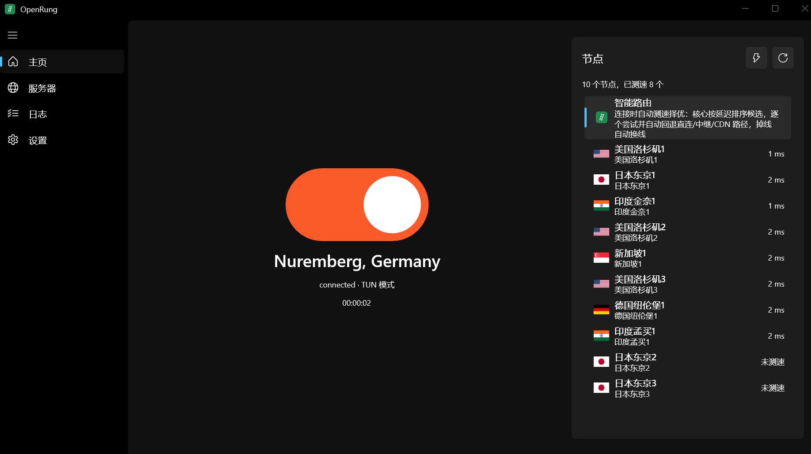
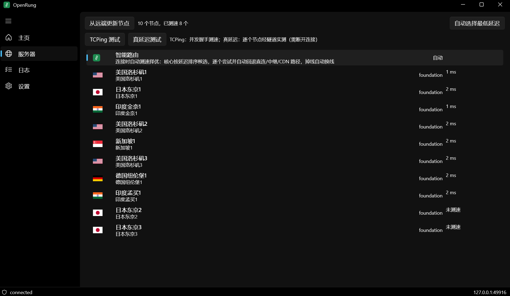
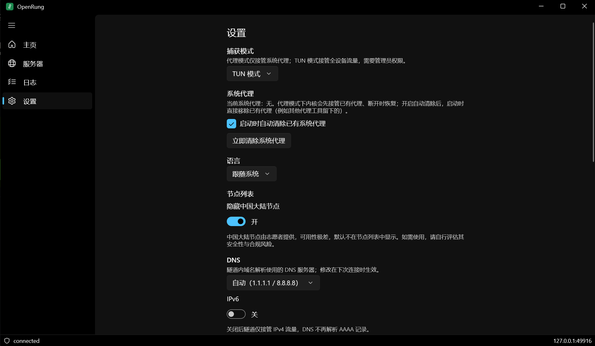
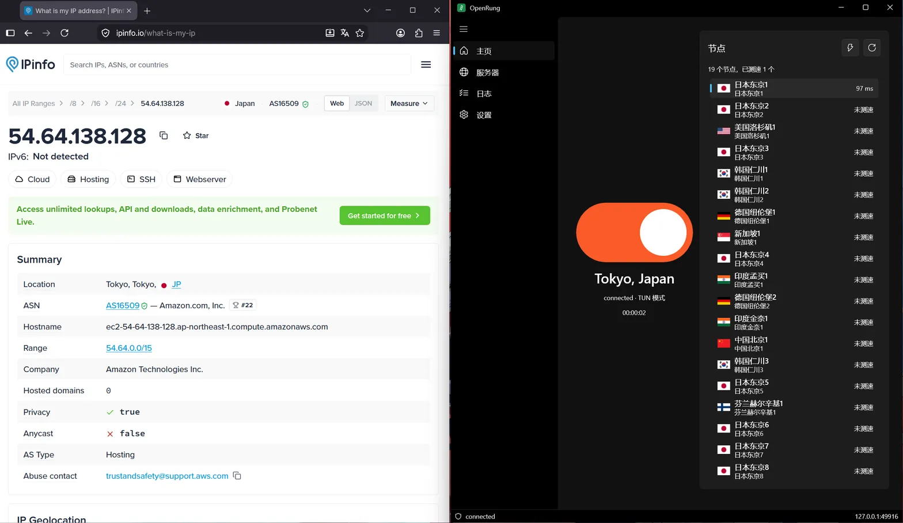

# OpenRung VPN WinUI3 Client / OpenRung VPN WinUI3 客户端

A modern, native Windows client for [OpenRung](https://github.com/openrung/openrung) built with **WinUI 3** (Windows App SDK), replacing the old Wails desktop app that was barely usable on Windows.<br>
一个使用 **WinUI 3**（Windows App SDK）构建的现代原生 Windows 客户端，用于替代在 Windows 上几乎无法使用的旧版 Wails 桌面应用。

One click connects you to the fastest relay; switches between local proxy mode and full-device TUN mode; lives in the system tray.<br>
一键连接到最快的节点；可在本地代理模式与全设备 TUN 模式间切换；常驻系统托盘。

## Download / 下载

Grab either package from the [Releases](https://github.com/SakurakaiCat/OpenrungVPN-winui3/releases) page:<br>
在 [Releases](https://github.com/SakurakaiCat/OpenrungVPN-winui3/releases) 页面获取两种发行包：

- **Installer** `OpenRung-Setup-<version>-x64.exe`: an Inno Setup wizard that creates Start-menu and desktop shortcuts for you.<br>
  **安装版** `OpenRung-Setup-<版本>-x64.exe`：Inno Setup 安装向导，自动创建开始菜单 / 桌面快捷方式。
- **Portable** `OpenRung-win-x64.zip`: unzip anywhere and run; no installation needed.<br>
  **便携版** `OpenRung-win-x64.zip`：解压即用，无需安装，适合绿色部署或 U 盘携带。

## Architecture / 架构

```
app/    C++/WinRT WinUI 3 GUI (C++20, unpackaged, self-contained)
core/   Go sidecar openrung-core.exe — wraps connectcore + bundled sing-box,
        exposing a small authenticated loopback JSON/SSE API (see API-CONTRACT.md)
```

```
app/    C++/WinRT WinUI 3 图形界面（C++20，非打包，自包含）
core/   Go 边车进程 openrung-core.exe — 封装 connectcore + 内置 sing-box，
        对外暴露一个小型、带认证的回环 JSON/SSE API（见 API-CONTRACT.md）
```

The GUI never touches the system proxy or the routing table itself; everything goes through the core engine, so crash recovery (proxy snapshot restore), direct-first WSS fallback, punching, and failover behave exactly like the official clients.<br>
GUI 从不直接触碰系统代理或路由表；一切经由核心引擎完成，因此崩溃恢复（代理快照还原）、直连优先的 WSS 回退、打洞与故障转移都与官方客户端的行为完全一致。

- **Physical-network epoch monitor**: the core snapshots the physical adapters once per second and feeds the engine's network-signal seam (the same seam as the official mobile clients' ADR-003). On Wi-Fi↔Ethernet switches, sleep/resume, or DHCP renewals, a live WSS session is retired and recovered with a fresh direct-first ladder at once, direct/punched sessions get an immediate health sweep, and the recovery gate releases instantly — instead of waiting out probe timeouts and the 5-second poll.<br>
  **物理网络纪元监控**：核心每秒对物理网卡做一次快照，并喂给引擎的网络信号接口（与官方移动端 ADR-003 相同的 seam）。Wi-Fi↔有线切换、睡眠唤醒或 DHCP 续约时，存活的 WSS 会话会立即退役并以全新直连优先梯子恢复，直连 / 打洞会话立即体检，恢复闸门即刻放行——不再等待探测超时与 5 秒轮询。

- **Proxy mode** (default): loopback mixed HTTP/SOCKS on a stable per-install port, with the system proxy pointed at it. No admin rights needed.<br>
  **代理模式**（默认）：在稳定的每安装端口上监听本地混合 HTTP/SOCKS，并将系统代理指向它；无需管理员权限。
- **TUN mode**: full-device capture through the bundled sing-box engine (wintun, no driver install). Needs Administrator — the app asks once via UAC and restarts only the core process elevated.<br>
  **TUN 模式**：通过内置 sing-box 引擎进行全设备捕获（wintun，无需安装驱动）。需要管理员权限——应用会通过 UAC 请求一次，且仅以提升权限重启核心进程。

## Build / 构建

Prerequisites: Go ≥ 1.25 and Visual Studio 2022 Build Tools (with the C++/WinRT and WinUI workloads).<br>
前置条件：Go ≥ 1.25 与 Visual Studio 2022 Build Tools（含 C++/WinRT 与 WinUI 工作负载）。

```powershell
# Windows: full build (core + app), outputs a portable dist\ folder:
# Windows：完整构建（核心 + 应用），输出便携 dist\ 目录：
powershell -ExecutionPolicy Bypass -File scripts\build.ps1

# Or build from WSL (drives the Windows host's MSBuild):
# 或者在 WSL 中构建（使用 Windows 宿主侧的 MSBuild）：
bash scripts/build.sh
```

The resulting `dist/` directory (`OpenRung.WinUI.exe` + `core/openrung-core.exe`) is fully portable: copy it anywhere and run `OpenRung.WinUI.exe`.<br>
构建产物 `dist/` 目录（`OpenRung.WinUI.exe` + `core/openrung-core.exe`）完全便携：拷贝到任意位置后直接运行 `OpenRung.WinUI.exe` 即可。

## Screenshots / 截图

| Home / 主页 | Servers / 服务器 |
| --- | --- |
|  |  |



**TUN connected** (right) with the exit IP verified on IPinfo (left): after connecting to the Tokyo relay, the public IP resolves to Tokyo, Japan.<br>
**TUN 模式连接**（右）与 IPinfo 出口 IP 验证（左）：连接东京节点后，IP 已变为节点所在地（日本东京）。



## Node filter / 节点过滤

Mainland China nodes are volunteer-provided with very poor availability and are hidden from the node lists by default (Settings → Node list → toggle). If you enable them, evaluate their security and compliance yourself.<br>
中国大陆节点由志愿者提供，可用性极差，默认在节点列表中隐藏（设置 → 节点列表 → 隐藏中国大陆节点可关闭）。如需使用，请自行评估其安全性与合规风险。

## Run / 运行

Double-click `OpenRung.WinUI.exe`. The big button connects; the mode switch chooses Proxy / TUN; the icon sits in the system tray.<br>
双击 `OpenRung.WinUI.exe`：大按钮负责连接；模式切换选择 代理 / TUN；图标常驻系统托盘。

## License / 许可证

GPL-3.0. This client is a fork of the upstream [openrung/openrung](https://github.com/openrung/openrung) project (also GPL-3.0), maintained by [@SakurakaiCat](https://github.com/SakurakaiCat); the `libs/` directory carries those first-party modules under their original license.<br>
GPL-3.0。本客户端是上游 [openrung/openrung](https://github.com/openrung/openrung)（同为 GPL-3.0）的二次开发版本，由 [@SakurakaiCat](https://github.com/SakurakaiCat) 维护；`libs/` 目录中的第一方模块沿用其原始许可证。
